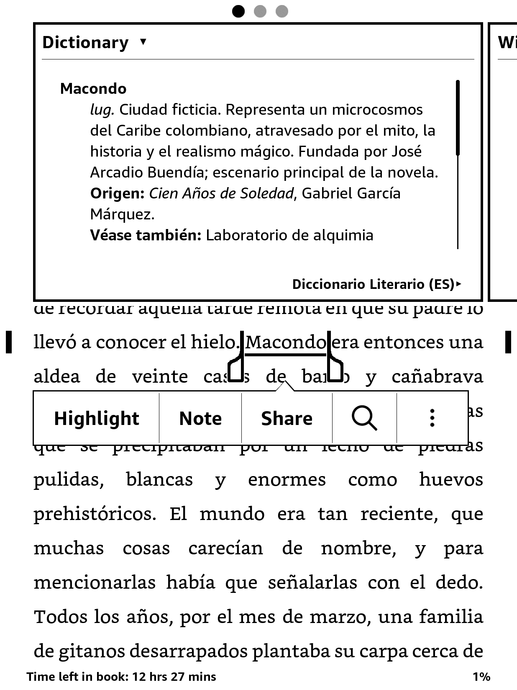
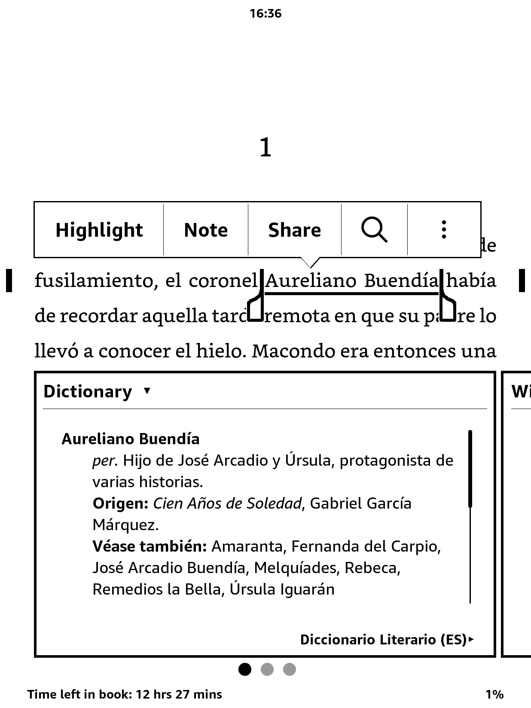
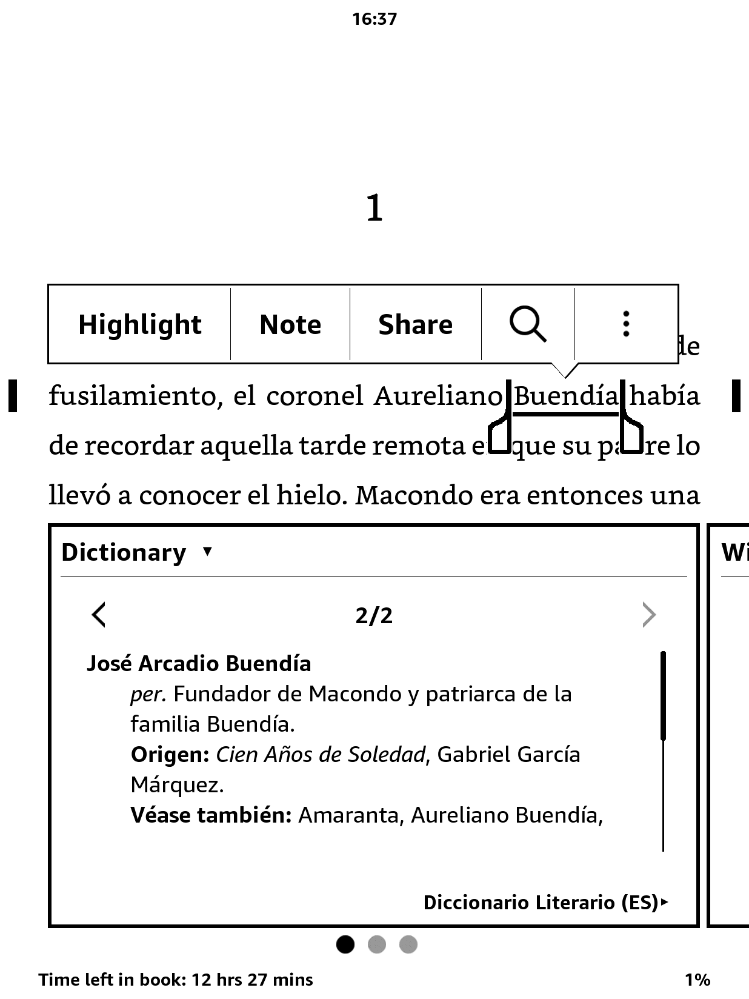
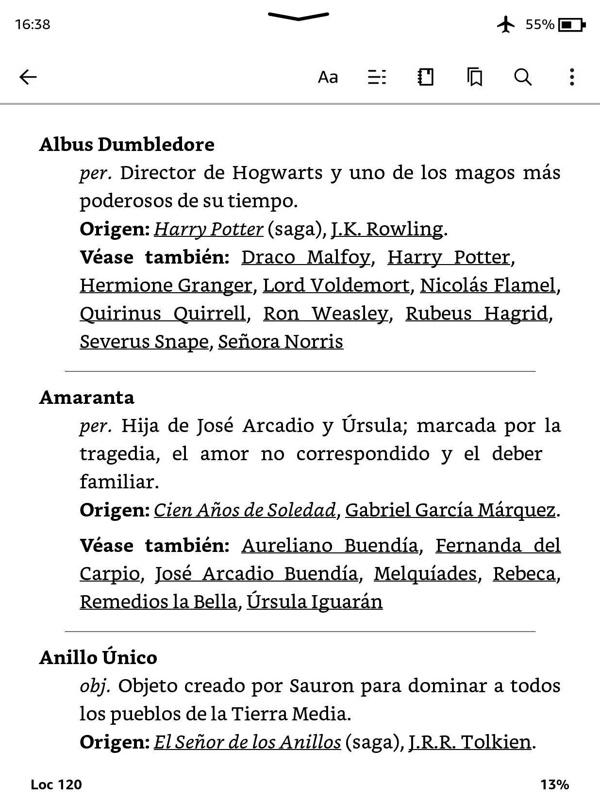

# 📚 Diccionario Literario para Kindle

[](README.md)
[](README.es.md)
[](README.it.md)
[](README.fr.md)
[](README.pt.md)

**Tu compañero de lectura definitivo.**
¿Te perdés entre los nombres de Cien años de soledad? ¿No recordás si ese objeto mágico era de Frodo o de Harry? Este **Diccionario Literario** de código abierto te ayuda a seguir personajes, lugares y conceptos de libros y sagas icónicas.

Originalmente diseñado para Kindle, el diccionario ahora también está disponible en formato EPUB — ideal para usar en el celular, la tablet o mientras leés un libro en papel.

> 📖 Acá podés buscar todos los libros, series y autores incluidos hasta el momento: [Cobertura del Diccionario](./Dictionary_Coverage.md)

|Idioma| Diccionario para Kindle ([más info](#️-instalación)) | EPUB ([más info](#-no-tenés-un-kindle-o-estás-leyendo-en-papel)) |
|---|---|---|
|🇬🇧 Inglés|[Descargar](https://github.com/cdmoro/literary-dictionary/releases/download/v1.2.0/Bonadeo.Carlos.-.Literary.Dictionary.EN.v1.2.0.mobi)|[Descargar](https://github.com/cdmoro/literary-dictionary/releases/download/v1.2.0/Bonadeo.Carlos.-.Literary.Dictionary.EN.v1.2.0.epub)|
|🇪🇸 Español|[Descargar](https://github.com/cdmoro/literary-dictionary/releases/download/v1.2.0/Bonadeo.Carlos.-.Diccionario.Literario.ES.v1.2.0.mobi)|[Descargar](https://github.com/cdmoro/literary-dictionary/releases/download/v1.2.0/Bonadeo.Carlos.-.Diccionario.Literario.ES.v1.2.0.epub)|
|🇮🇹 Italiano|[Descargar](https://github.com/cdmoro/literary-dictionary/releases/download/v1.2.0/Bonadeo.Carlos.-.Dizionario.Letterario.IT.v1.2.0.mobi)|[Descargar](https://github.com/cdmoro/literary-dictionary/releases/download/v1.2.0/Bonadeo.Carlos.-.Dizionario.Letterario.IT.v1.2.0.epub)|
|🇫🇷 Francés|[Descargar](https://github.com/cdmoro/literary-dictionary/releases/download/v1.2.0/Bonadeo.Carlos.-.Dictionnaire.Litteraire.FR.v1.2.0.mobi)|[Descargar](https://github.com/cdmoro/literary-dictionary/releases/download/v1.2.0/Bonadeo.Carlos.-.Dictionnaire.Litteraire.FR.v1.2.0.epub)|
|🇧🇷 Portugués|[Descargar](https://github.com/cdmoro/literary-dictionary/releases/download/v1.2.0/Bonadeo.Carlos.-.Dicionario.Literario.PT.v1.2.0.mobi)|[Descargar](https://github.com/cdmoro/literary-dictionary/releases/download/v1.2.0/Bonadeo.Carlos.-.Dicionario.Literario.PT.v1.2.0.epub)|

## 🛠️ Instalación

Instalar el Diccionario Literario para Kindle es fácil y rápido:

1. Descargá el archivo `.mobi` en el idioma que prefieras desde los enlaces de arriba.
1. Conectá tu Kindle a la computadora mediante un cable USB.
1. Copiá el archivo `.mobi` en la carpeta `documents/dictionaries` de tu Kindle. Si la carpeta no existe, podés crearla manualmente.
1. Expulsá tu Kindle de forma segura y desconectalo.

## 🧭 Cómo usarlo

El Kindle no permite elegir un diccionario personalizado desde la configuración general. En su lugar:

1. Abrí un libro.
1. Seleccioná una palabra dejando el dedo presionado sobre ella.
1. Cuando aparezca la definición, tocá el nombre del diccionario en la parte inferior de la ventana.
1. Elegí el **Diccionario Literario** de la lista.

Tu Kindle recordará esa elección para futuras lecturas en ese idioma.

## 📱 ¿No tenés un Kindle o estás leyendo en papel?

¡No hay problema!
Descargá la versión en **EPUB**, abrila con apps como Apple Books o Google Play Books en tu celular, ¡y listo! Vas a poder consultar el diccionario mientras leés, sin complicaciones.

📌 Extra: El **EPUB** incluye una útil sección de `Fichas de lectura` — un resumen rápido de todos los personajes, agrupados por libro. Ideal para tener a mano mientras leés.

## ✨ Características

El **Diccionario Literario para Kindle** está hecho para que tu lectura sea más inmersiva y menos confusa—accesible directamente desde el diccionario integrado del dispositivo.

### ✅ Funcionalidades Clave

- **Funciona con palabras sueltas y expresiones de varias palabras**
- **Compatible con libros en cualquier idioma**
- **Totalmente integrado con el sistema de diccionarios de Kindle**
- **Referencias cruzadas entre personajes, lugares y conceptos de distintos universos literarios**
- **Muestra múltiples definiciones si un nombre tiene más de una entrada (por ejemplo, apellidos familiares)**
- **Entradas claras y concisas, optimizadas para búsquedas rápidas**
- **Liviano, fácil de instalar y sin distracciones**

### 📸 Capturas de pantalla

| Búsqueda por una palabra | Búsqueda por grupos de palabra | Múltiples resultados | Referencias cruzadas |
|:--------------------:|:-------------------:|:---------------------------|:---------:|
|||||

---

## 🛠️ Cómo Contribuir

¿Te apasionan los libros y la tecnología? ¡Sumate al proyecto!

- Proponé libros para agregar
- Mejorá los scripts en Python
- Reportá errores o sugerí funciones
- Compartí tu universo literario favorito

También podés:
- ☕ [Invitarme un café](https://buymeacoffee.com/cdmoro)
- 🧉 [Invitarme un cafecito](http://cafecito.app/cdmoro)
- 🎁 [Apoyar en Patreon](https://patreon.com/cdmoro)

---

## 🧪 Configuración para Desarrollo

Para generar y probar el diccionario localmente:

```bash
git clone https://github.com/cdmoro/literary-dictionary.git
cd literary-dictionary
pip install -r requirements.txt
python ./main.py
```

Después:

1. Abrí Kindle Previewer 3
1. Cargá el archivo EPUB generado o `dictionary_files_es/content.opf`
1. Exportalo como MOBI
1. Copialo a la carpeta `documents/dictionaries` de tu Kindle

¡Listo! 🔍📖

## 🙋‍♂️ Sobre mí

Hola, soy Carlos — lector empedernido, programador y hacker de Kindle.

- 🐦 [Twitter](https://twitter.com/CarlosBonadeo)
- 💼 [LinkedIn](https://www.linkedin.com/in/cdbonadeo/)

Llevemos la literatura al siguiente nivel, una búsqueda a la vez.

## Licencia


Este contenido está licenciado bajo una [Creative Commons Atribución-NoComercial 4.0 Internacional (CC BY-NC 4.0)](https://creativecommons.org/licenses/by-nc/4.0/deed.es). Se permite copiar, redistribuir y modificar siempre que se otorgue el crédito correspondiente y no se use con fines comerciales.
