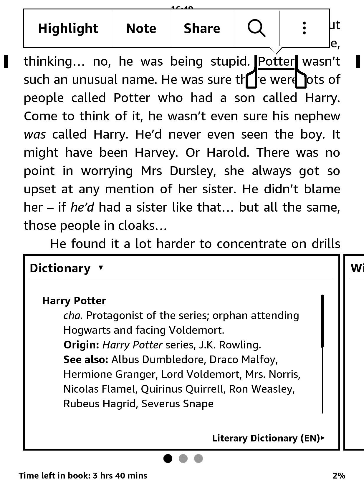
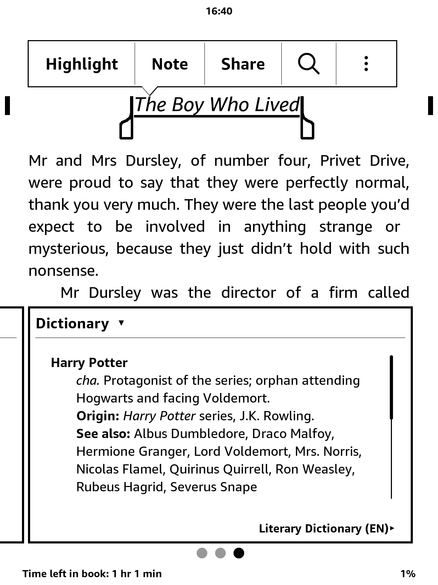

# 📚 Dictionnaire littéraire pour Kindle

[](README.md)
[](README.es.md)
[](README.it.md)
[](README.fr.md)
[](README.pt.md)

**Votre compagnon de lecture ultime.**
Perdu dans le labyrinthe des noms de Cent ans de solitude ? Vous ne vous souvenez plus si cet objet magique appartenait à Frodo ou à Harry ? Ce **Dictionnaire Littéraire** open source vous aide à suivre les personnages, lieux et concepts des livres et sagas cultes.

Initialement conçu pour Kindle, le dictionnaire est désormais disponible en format EPUB — parfait pour l’utiliser sur votre téléphone, tablette, ou en lisant un livre papier.

> 📖 Ici, vous pouvez consulter tous les livres, séries et auteurs inclus jusqu'à présent : [Couverture du Dictionnaire](./Dictionary_Coverage.md)

|Langue| Dictionnaire pour Kindle ([plus d’infos](#️-kindle-version-installation)) | EPUB ([plus d’infos](#-dont-have-a-kindle-or-reading-a-physical-book)) |
|---|---|---|
|🇬🇧 Anglais|[Télécharger](https://github.com/cdmoro/literary-dictionary/releases/download/v1.2.0/Bonadeo.Carlos.-.Literary.Dictionary.EN.v1.2.0.mobi)|[Télécharger](https://github.com/cdmoro/literary-dictionary/releases/download/v1.2.0/Bonadeo.Carlos.-.Literary.Dictionary.EN.v1.2.0.epub)|
|🇪🇸 Espagnol|[Télécharger](https://github.com/cdmoro/literary-dictionary/releases/download/v1.2.0/Bonadeo.Carlos.-.Diccionario.Literario.ES.v1.2.0.mobi)|[Télécharger](https://github.com/cdmoro/literary-dictionary/releases/download/v1.2.0/Bonadeo.Carlos.-.Diccionario.Literario.ES.v1.2.0.epub)|
|🇮🇹 Italien|[Télécharger](https://github.com/cdmoro/literary-dictionary/releases/download/v1.2.0/Bonadeo.Carlos.-.Dizionario.Letterario.IT.v1.2.0.mobi)|[Télécharger](https://github.com/cdmoro/literary-dictionary/releases/download/v1.2.0/Bonadeo.Carlos.-.Dizionario.Letterario.IT.v1.2.0.epub)|
|🇫🇷 Français|[Télécharger](https://github.com/cdmoro/literary-dictionary/releases/download/v1.2.0/Bonadeo.Carlos.-.Dictionnaire.Litteraire.FR.v1.2.0.mobi)|[Télécharger](https://github.com/cdmoro/literary-dictionary/releases/download/v1.2.0/Bonadeo.Carlos.-.Dictionnaire.Litteraire.FR.v1.2.0.epub)|
|🇧🇷 Portugais|[Télécharger](https://github.com/cdmoro/literary-dictionary/releases/download/v1.2.0/Bonadeo.Carlos.-.Dicionario.Literario.PT.v1.2.0.mobi)|[Télécharger](https://github.com/cdmoro/literary-dictionary/releases/download/v1.2.0/Bonadeo.Carlos.-.Dicionario.Literario.PT.v1.2.0.epub)|

## 🛠️ Installation

L'installation du dictionnaire littéraire pour Kindle est rapide et facile :

1. Téléchargez le fichier `.mobi` dans la langue de votre choix à partir des liens ci-dessus.
1. Connectez votre Kindle à votre ordinateur via USB.
1. Copiez le fichier `.mobi` dans le dossier `documents/dictionaries` de votre Kindle. Si ce dossier n'existe pas, vous pouvez le créer manuellement.
1. Éjectez votre Kindle en toute sécurité et déconnectez-le de votre ordinateur.

## 🧭 Comment l'utiliser

Kindle ne vous permet pas de choisir un nouveau dictionnaire dans les paramètres généraux des dictionnaires personnalisés. À la place :

1. Ouvrez un livre.
1. Sélectionnez un mot en appuyant dessus et en le maintenant enfoncé.
1. Lorsque la définition apparaît, appuyez sur le nom du dictionnaire en bas de la fenêtre.
1. Choisissez le **Dictionnaire littéraire** dans la liste.

Votre Kindle mémorisera désormais ce choix pour les futures recherches dans les livres de cette langue.

## 📱 Pas de Kindle ou vous lisez un livre papier ?

Pas de souci !
Téléchargez simplement la version **EPUB**, ouvrez-la avec des applications comme Apple Books ou Google Play Books, et voilà — vous pouvez consulter le dictionnaire tout en lisant, sans tracas.

📌 Bonus : La version **EPUB** inclut aussi une section pratique de `Fiches de lecture` — un résumé rapide de tous les personnages classés par livre. Parfait pour s’y référer au fil de la lecture.

## ✨ Caractéristiques

Le **Dictionnaire littéraire pour Kindle** est conçu pour rendre votre expérience de lecture plus immersive et moins confuse. Il est accessible directement depuis le dictionnaire intégré à votre appareil.

### ✅ Caractéristiques principales

- **Prend en charge les mots isolés et les expressions composées de plusieurs mots**  
- **Fonctionne avec des livres dans toutes les langues**
- **Entièrement compatible avec le système de dictionnaire natif de Kindle**
- **Références croisées entre les personnages, les lieux et les concepts à travers les univers littéraires**
- **Renvoie plusieurs définitions lorsqu'un nom a plus d'une entrée (par exemple, les noms de famille)**
- **Entrées claires et concises, optimisées pour une recherche rapide**
- **Léger, facile à installer et sans distraction**

### 📸 Captures d'écran

| Recherche d'un seul mot | Expression à plusieurs mots | Prise en charge de plusieurs définitions | Entrées de références croisées |
|:--------------------:|:-------------------:|:---------------------------:|:---------:|
|||||

---

## 🛠️ Comment contribuer

Vous aimez les livres et la technologie ? Rejoignez la mission !

- Suggérez de nouveaux livres à inclure
- Améliorez les scripts Python
- Signalez les bugs ou demandez des fonctionnalités
- Partagez votre univers littéraire préféré !

Vous pouvez également :
- ☕ [M'offrir un café](https://buymeacoffee.com/cdmoro)
- 🧉 [M'inviter à prendre un cafecito](http://cafecito.app/cdmoro)
- 🎁 [Me soutenir sur Patreon](https://patreon.com/cdmoro)

---

## 🧪 Configuration de développement

Pour compiler et tester le dictionnaire localement :

```bash
git clone https://github.com/cdmoro/literary-dictionary.git
cd literary-dictionary
pip install -r requirements.txt
python ./main.py
```

Cela générera plusieurs dictionnaires par langue dans le dossier « output ».

Ensuite :

1. Ouvrez Kindle Previewer 3.
1. Chargez l'EPUB généré ou « dictionary_files_en/content.opf ».
1. Exportez vers MOBI.
1. Copiez dans le dossier « documents/dictionaries » de votre Kindle.

Vous êtes prêt ! 🔍📖

## 🙋‍♂️ À propos de moi

Bonjour ! Je m'appelle Carlos, je suis passionné de lecture, codeur et hacker Kindle.

- 🐦 [Twitter](https://twitter.com/CarlosBonadeo)
- 💼 [LinkedIn](https://www.linkedin.com/in/cdbonadeo/)

Donnez vie à la littérature, une recherche à la fois.

## Licence


Ce contenu est sous licence [Creative Commons Attribution-NonCommercial 4.0 International (CC BY-NC 4.0)](https://creativecommons.org/licenses/by-nc/4.0/). Vous êtes autorisé à copier, redistribuer et modifier le contenu à condition d'en citer la source et de ne pas l'utiliser à des fins commerciales.