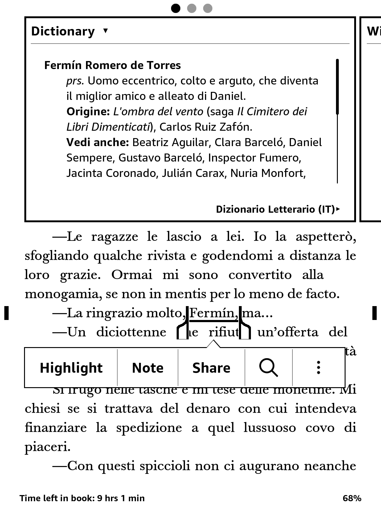
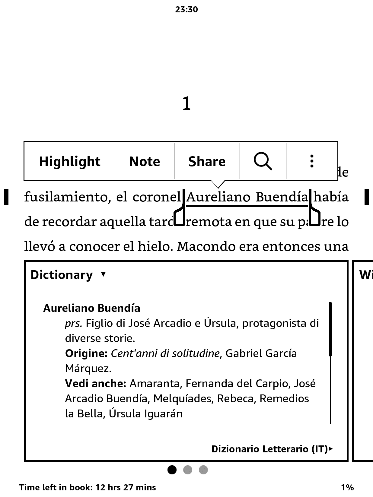
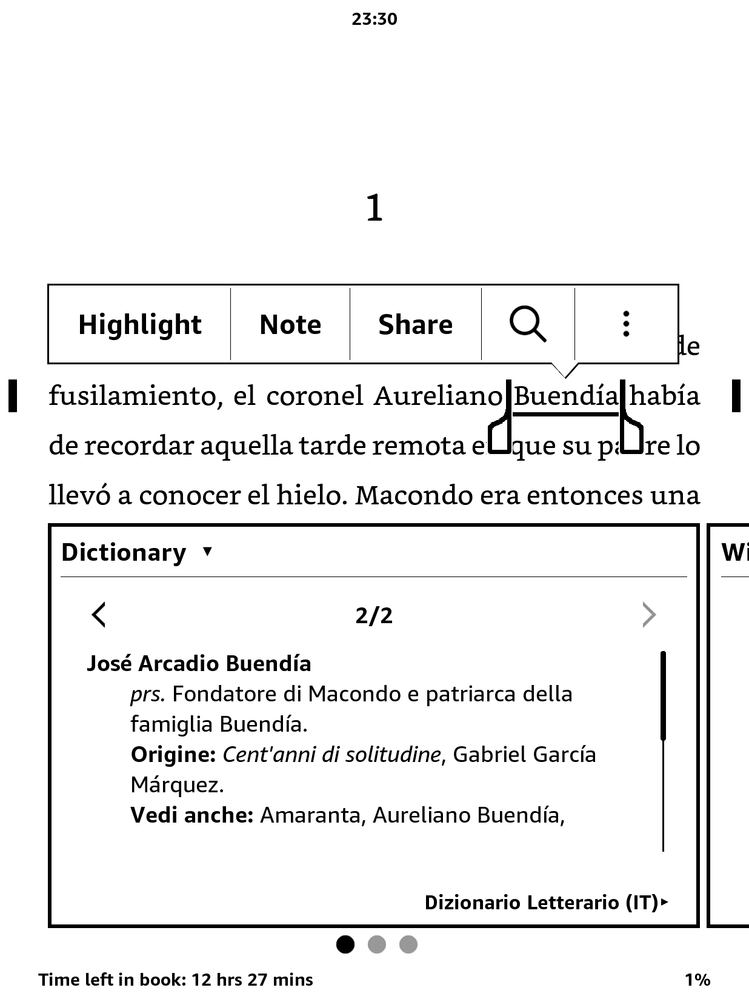
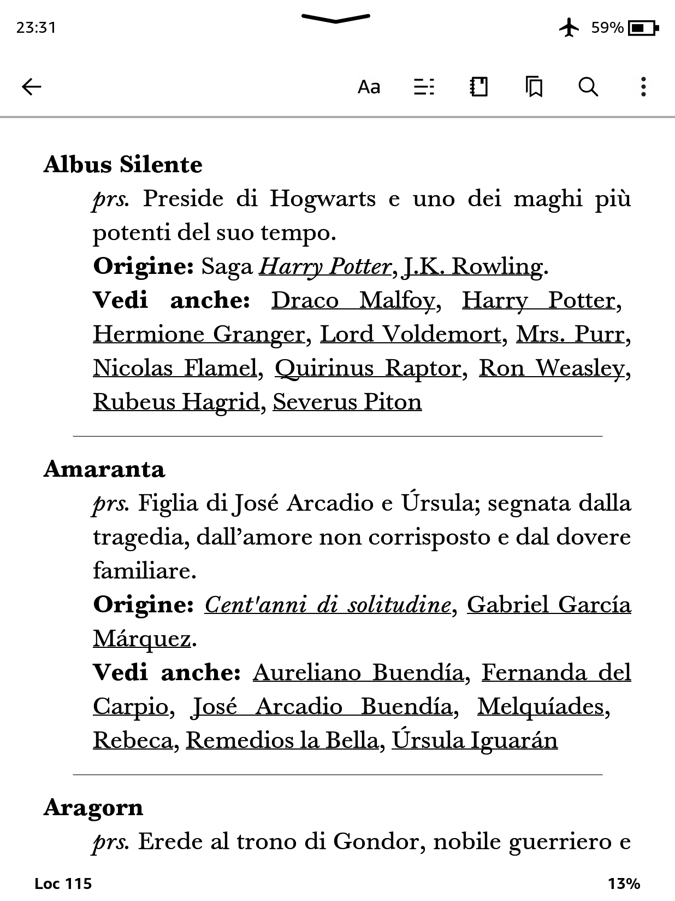
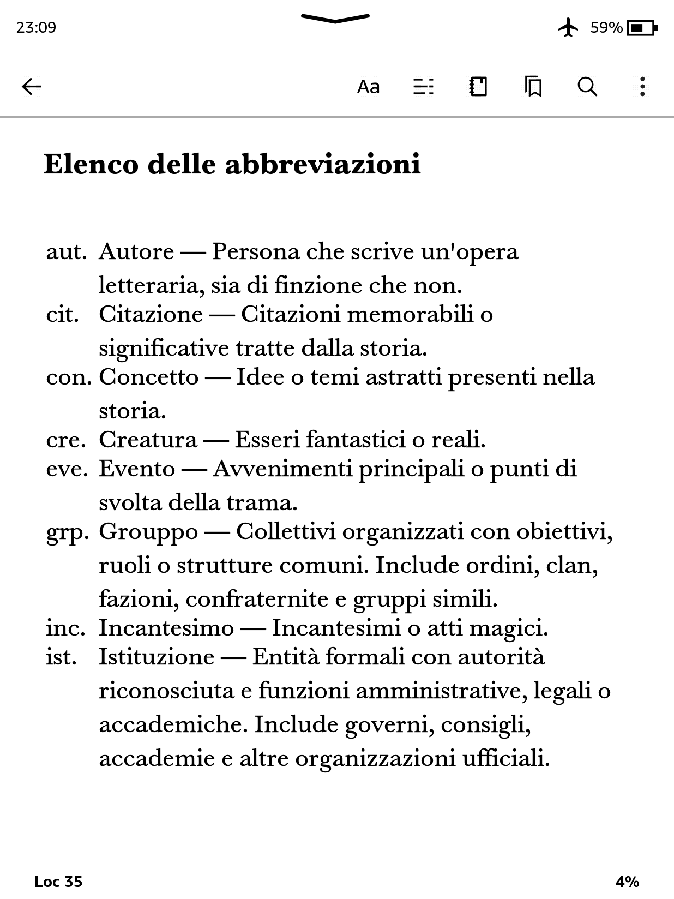
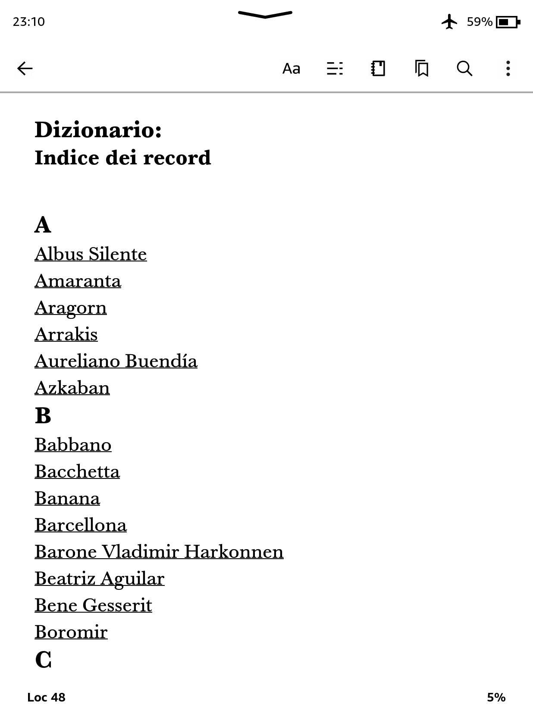
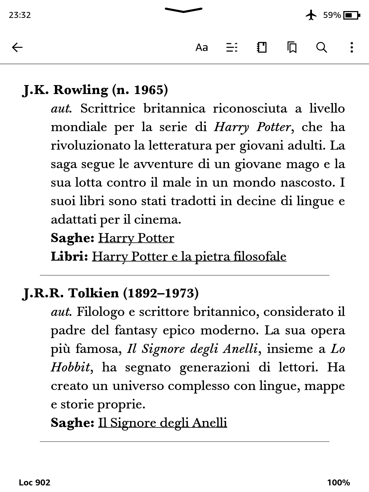
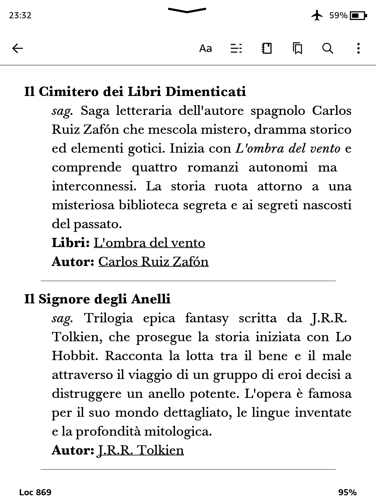

# 📚 Dizionario Letterario per Kindle

[](README.md)
[](README.es.md)
[](README.it.md)

**Il tuo compagno di lettura definitivo.**  
Perso nel labirinto di nomi de _Cent'anni di solitudine_? Non ricordi se quell'oggetto magico appartenesse a Frodo o a Harry? Questo **Dizionario Letterario** open-source ti aiuta a tenere traccia di personaggi, luoghi e concetti di libri e saghe iconiche—direttamente dal tuo Kindle.

Il dizionario è attualmente disponibile nelle seguenti lingue, ognuna offerta come file separato:

- 🇬🇧 Inglese — [Scarica](https://github.com/cdmoro/literary-dictionary/releases/download/v1.0.0/Bonadeo.Carlos.-.Diccionario.Literario.EN.v1.0.0.mobi)
- 🇪🇸 Spagnolo — [Scarica](https://github.com/cdmoro/literary-dictionary/releases/download/v1.0.0/Bonadeo.Carlos.-.Diccionario.Literario.ES.v1.0.0.mobi)
- 🇮🇹 Italiano — Prossimamente!

Ogni versione è progettata con cura per garantire una lettura fluida e una navigazione agevole su Kindle e altri e-reader. Altre lingue sono previste per le prossime versioni.

🗒️ Puoi anche visitare la sezione [Releases](https://github.com/cdmoro/literary-dictionary/releases) per vedere il registro delle modifiche e le versioni precedenti.

## ✨ Caratteristiche

Il **Dizionario Letterario per Kindle** è costruito per rendere la tua esperienza di lettura più immersiva e meno confusa—accessibile direttamente dal dizionario integrato del tuo dispositivo.

### ✅ Funzionalità principali

- **Supporta sia parole singole che espressioni multi-parola**  
- **Funziona con libri in qualsiasi lingua**
- **Pienamente compatibile con il sistema di dizionario nativo di Kindle**
- **Collega personaggi, luoghi e concetti tra universi letterari**
- **Restituisce più definizioni quando un nome ha più voci (es. cognomi di famiglia)**
- **Voci pulite e concise, ottimizzate per una consultazione rapida**
- **Leggero, facile da installare e senza distrazioni**

### 📸 Screenshot

| Ricerca di parola singola | Frase multi-parola | Supporto a definizioni multiple | Voci con riferimenti incrociati |
|:--------------------------:|:------------------:|:------------------------------:|:------------------------------:|
|||||
| **Guida alle abbreviazioni** | **Indice delle voci per sezione** | **Sezione Autori** | **Sezione Saghe** |
|||||

---

## 🛠️ Come contribuire

Ami i libri e la tecnologia? Unisciti alla missione!

- Suggerisci nuovi libri da includere
- Migliora gli script Python
- Segnala bug o richiedi funzionalità
- Condividi il tuo universo letterario preferito!

Puoi anche:
- ☕ [Offrimi un caffè](https://buymeacoffee.com/cdmoro)
- 🧉 [Invitami un cafecito](http://cafecito.app/cdmoro)
- 🎁 [Supportami su Patreon](https://patreon.com/cdmoro)

---

## 🧪 Setup per sviluppatori

Per costruire e testare il dizionario localmente:

```bash
git clone https://github.com/cdmoro/literary-dictionary.git
cd literary-dictionary
pip install -r requirements.txt
python ./main.py
```

Genererà un dizionario per ogni lingua nella cartella `output`.

Poi:

1. Apri Kindle Previewer  
2. Carica l'EPUB generato o `dictionary_files_it/content.opf`  
3. Esporta in formato MOBI  
4. Copialo nella cartella `dictionaries` del tuo Kindle  

Sei pronto per iniziare! 🔍📖

## 🙋‍♂️ Su di me

Ciao! Sono Carlos — appassionato di libri, programmatore e hacker Kindle.

- 🐦 [Twitter](https://twitter.com/CarlosBonadeo)
- 💼 [LinkedIn](https://www.linkedin.com/in/cdbonadeo/)

Portiamo la letteratura alla vita, una ricerca alla volta.

## Licenza


Questo contenuto è concesso in licenza con una <a href="https://creativecommons.org/licenses/by-nc/4.0/">Creative Commons Attribuzione-Non Commerciale 4.0 Internazionale (CC BY-NC 4.0)</a>. È permesso copiare, ridistribuire e modificare il contenuto purché venga riconosciuto il merito all'autore e non sia usato per scopi commerciali.
