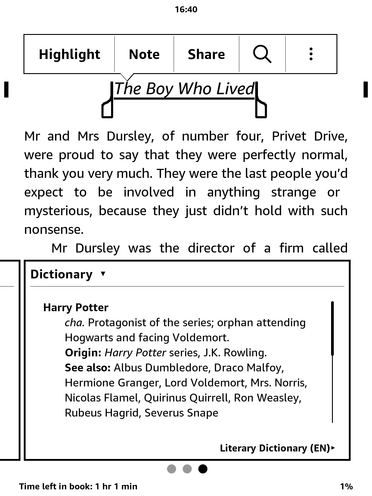
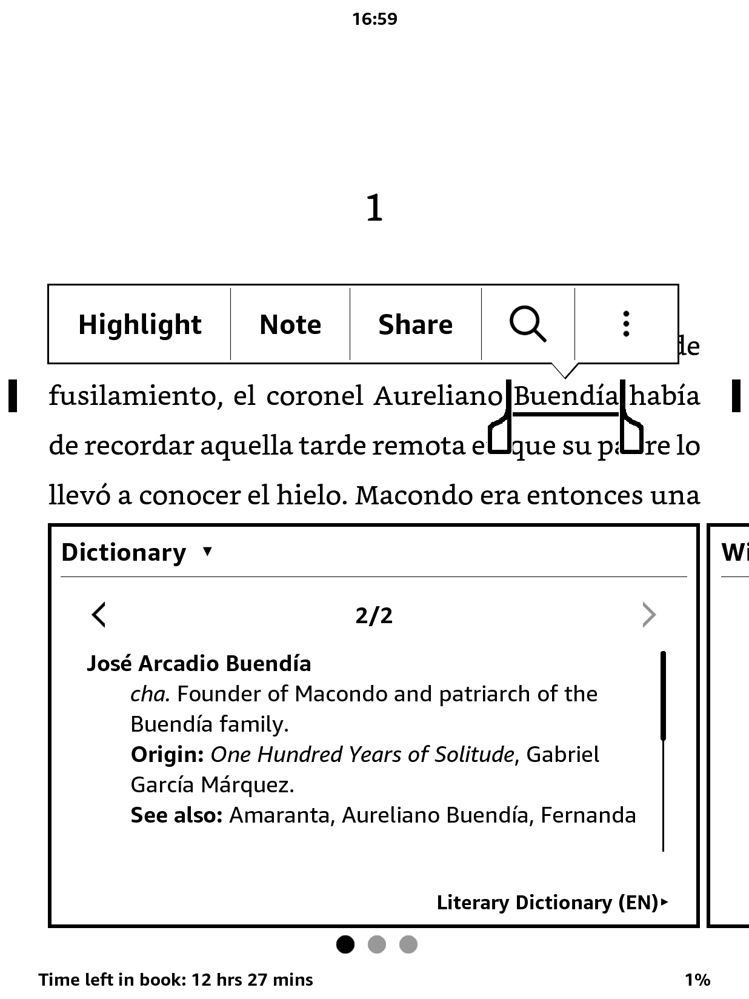
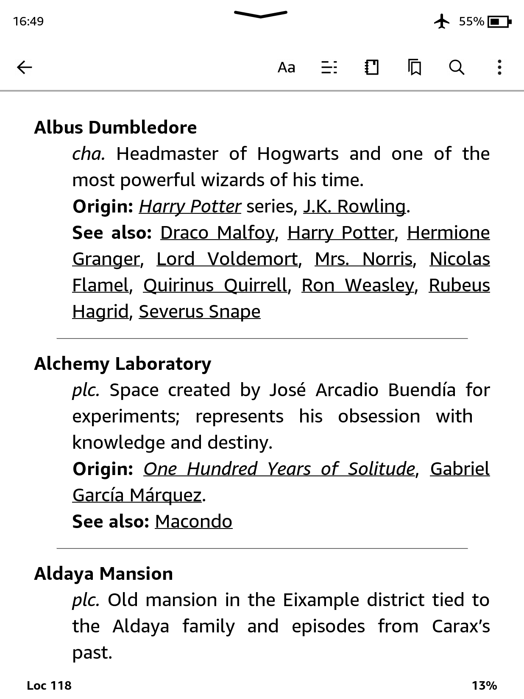

# 📚 Literary Dictionary for Kindle

[](README.md)
[](README.es.md)
[](README.it.md)
[](README.fr.md)
[](README.pt.md)

**Your ultimate reading companion.**
Lost in the maze of names from _One Hundred Years of Solitude_? Can’t remember if that magical object belonged to Frodo or Harry? This open-source **Literary Dictionary** helps you keep track of characters, places, and concepts from iconic books and sagas.

Originally designed for Kindle, the dictionary is now also available in **EPUB format** — for anyone who wants to use it on their phone, tablet, or while reading a physical book.

|Language| Dictionary for Kindle ([more info](#️-kindle-version-installation)) | EPUB ([more info](#-dont-have-a-kindle-or-reading-a-physical-book)) |
|---|---|---|
|🇬🇧 English|[Download](https://github.com/cdmoro/literary-dictionary/releases/download/v1.2.0/Bonadeo.Carlos.-.Literary.Dictionary.EN.v1.2.0.mobi)|[Download](https://github.com/cdmoro/literary-dictionary/releases/download/v1.2.0/Bonadeo.Carlos.-.Literary.Dictionary.EN.v1.2.0.epub)|
|🇪🇸 Spanish|[Download](https://github.com/cdmoro/literary-dictionary/releases/download/v1.2.0/Bonadeo.Carlos.-.Diccionario.Literario.ES.v1.2.0.mobi)|[Download](https://github.com/cdmoro/literary-dictionary/releases/download/v1.2.0/Bonadeo.Carlos.-.Diccionario.Literario.ES.v1.2.0.epub)|
|🇮🇹 Italian|[Download](https://github.com/cdmoro/literary-dictionary/releases/download/v1.2.0/Bonadeo.Carlos.-.Dizionario.Letterario.IT.v1.2.0.mobi)|[Download](https://github.com/cdmoro/literary-dictionary/releases/download/v1.2.0/Bonadeo.Carlos.-.Dizionario.Letterario.IT.v1.2.0.epub)|
|🇫🇷 French|[Download](https://github.com/cdmoro/literary-dictionary/releases/download/v1.2.0/Bonadeo.Carlos.-.Dictionnaire.Litteraire.FR.v1.2.0.mobi)|[Download](https://github.com/cdmoro/literary-dictionary/releases/download/v1.2.0/Bonadeo.Carlos.-.Dictionnaire.Litteraire.FR.v1.2.0.epub)|
|🇧🇷 Portuguese|[Download](https://github.com/cdmoro/literary-dictionary/releases/download/v1.2.0/Bonadeo.Carlos.-.Dicionario.Literario.PT.v1.2.0.mobi)|[Download](https://github.com/cdmoro/literary-dictionary/releases/download/v1.2.0/Bonadeo.Carlos.-.Dicionario.Literario.PT.v1.2.0.epub)|

## 🛠️ Kindle version installation

Installing the Literary Dictionary for Kindle is quick and easy:

1. Download the `.mobi` file in your preferred language from the links above.
1. Connect your Kindle to your computer via USB.
1. Copy the `.mobi` file to the `documents/dictionaries` folder on your Kindle. If this folder doesn’t exist, you can create it manually.
1. Eject your Kindle safely and disconnect it from your computer.

## 🧭 How to use it

Kindle does not let you choose a new dictionary from the general settings for custom dictionaries. Instead:

1. Open a book.
1. Select a word by pressing and holding it.
1. When the definition pops up, tap the dictionary name at the bottom of the window.
1. Choose the **Literary Dictionary** from the list.

Your Kindle will now remember that choice for future lookups in books of that language.

## 📱 Don’t have a Kindle or reading a physical book?

No worries!
Just download the __EPUB__ version, open it on your phone using apps like Apple Books or Google Play Books, and that’s it — you’ll be able to browse the dictionary while you read, hassle-free.

📌 Bonus: The __EPUB__ also includes a handy __Reading Notes__ section — a quick summary of all characters grouped by books, perfect for reference as you go.

## ✨ Features

The **Literary Dictionary for Kindle** is built to make your reading experience more immersive and less confusing—accessible directly from your device’s built-in dictionary.

### ✅ Key Features

- **Supports both single words and multi-word expressions**
- **Works with books in any language**
- **Fully compatible with Kindle’s native dictionary system**
- **Cross-references characters, places, and concepts across literary universes**
- **Returns multiple definitions when a name has more than one entry (e.g., family surnames)**
- **Clean and concise entries, optimized for quick lookup**
- **Lightweight, easy to install, and distraction-free**

### 📸 Screenshots

| Single Word Lookup | Multi-word Phrase | Multiple Definitions Support | Cross-reference entries |
|:--------------------:|:-------------------:|:---------------------------:|:---------:|
|||||

---

## 🛠️ How to Contribute

Love books and tech? Join the mission!

- Suggest new books to include
- Improve the Python scripts
- Report bugs or request features
- Share your favourite literary universe!

You can also:
- ☕ [Buy me a coffee](https://buymeacoffee.com/cdmoro)
- 🧉 [Invite me a cafecito](http://cafecito.app/cdmoro)
- 🎁 [Support on Patreon](https://patreon.com/cdmoro)

---

## 🧪 Dev Setup

To build and test the dictionary locally:

```bash
git clone https://github.com/cdmoro/literary-dictionary.git
cd literary-dictionary
pip install -r requirements.txt
python ./main.py
```

It will generate several one dictionary per language in `output` folder.

Then:

1. Open Kindle Previewer 3
1. Load the generated EPUB or `dictionary_files_en/content.opf`
1. Export to MOBI
1. Copy to your Kindle’s `documents/dictionaries` folder

You’re ready to go! 🔍📖

## 🙋‍♂️ About Me

Hi! I’m Carlos — book lover, coder, and Kindle hacker.

- 🐦 [Twitter](https://twitter.com/CarlosBonadeo)
- 💼 [LinkedIn](https://www.linkedin.com/in/cdbonadeo/)

Let’s bring literature to life, one lookup at a time.

## License


This content is licensed under a [Creative Commons Attribution-NonCommercial 4.0 International (CC BY-NC 4.0)](https://creativecommons.org/licenses/by-nc/4.0/) license. You are allowed to copy, redistribute, and modify the content as long as proper credit is given and it is not used for commercial purposes.
