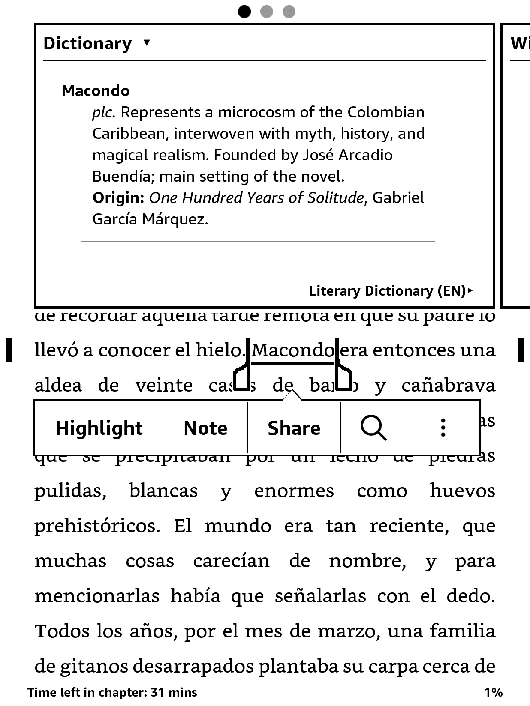
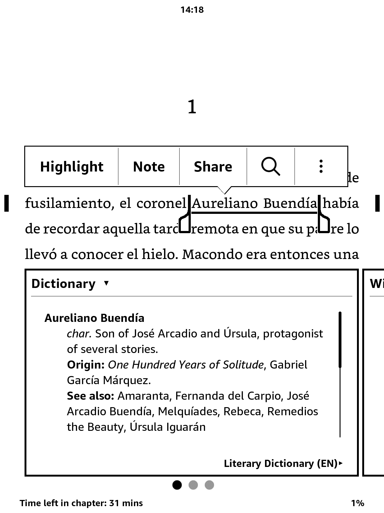
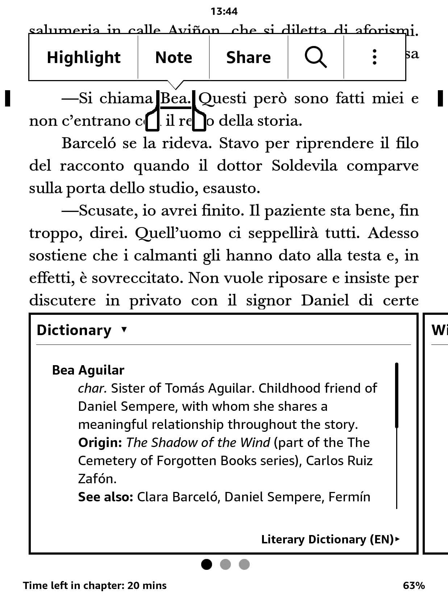
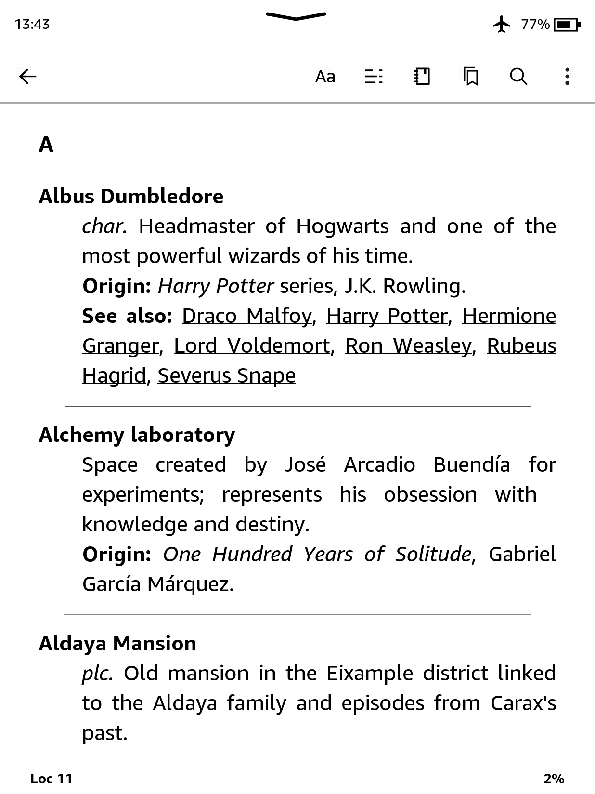
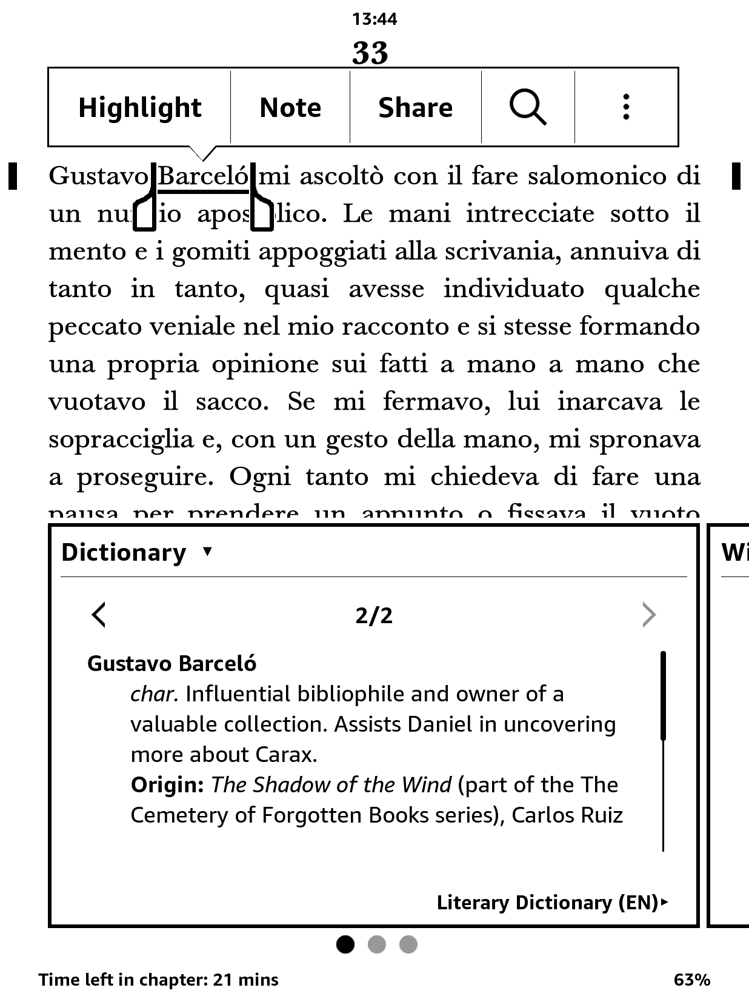
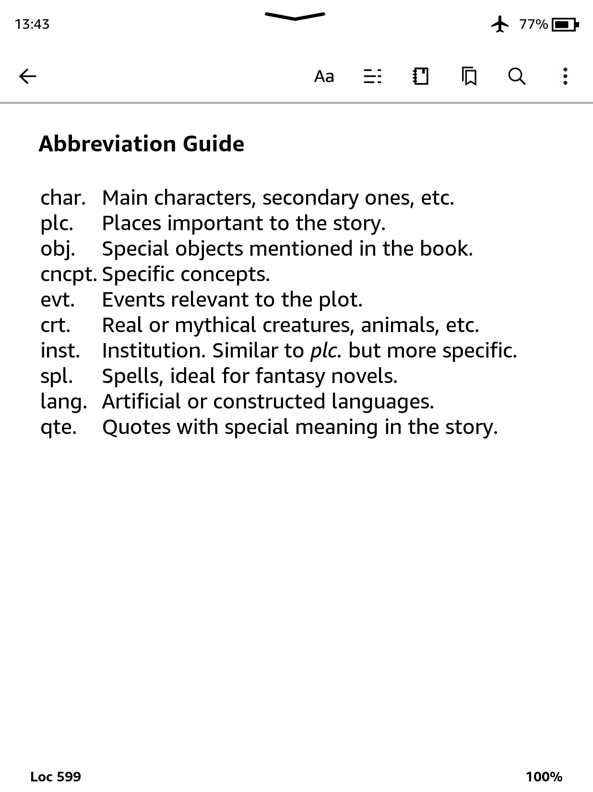

# 📚 Literary Dictionary for Kindle

**Your ultimate reading companion.**  
Lost in the maze of names from _One Hundred Years of Solitude_? Can’t remember if that magical object belonged to Frodo or Harry? This open-source **Literary Dictionary** helps you keep track of characters, places, and concepts from iconic books and sagas—right from your Kindle.

The dictionary is currently available in English and Spanish, with more languages planned for future releases. Each version is carefully designed to ensure smooth reading and navigation on Kindle and other e-reader devices.

🎯 Download the latest version of the dictionary [here](https://github.com/cdmoro/literary-dictionary/releases/latest)

## ✨ Features

The **Literary Dictionary for Kindle** is built to make your reading experience more immersive and less confusing—accessible directly from your device’s built-in dictionary.

### ✅ Key Features

- **Supports both single words and multi-word expressions**  
- **Works with books in any language**
- **Fully compatible with Kindle’s native dictionary system**
- **Cross-references characters, places, and concepts across literary universes**
- **Returns multiple definitions when a name has more than one entry (e.g., family surnames)**
- **Clean and concise entries, optimized for quick lookup**
- **Lightweight, easy to install, and distraction-free**

### 📸 Screenshots

| Single Word Lookup | Multi-word Phrase | Foreign Language Support |
|--------------------|-------------------|---------------------------|
|  |  |  |

| Cross-referenced Entry | Multiple Definitions | Abbreviation Guide |
|------------------------|------------------------|------------------------|
|  |  |  |

---

## 🛠️ How to Contribute

Love books and tech? Join the mission!

- Suggest new books to include
- Improve the Python scripts
- Report bugs or request features
- Share your favorite literary universe!

You can also:
- ☕ [Buy me a coffee](https://buymeacoffee.com/cdmoro)
- 🧉 [Invite me a cafecito](http://cafecito.app/cdmoro)
- 🎁 [Support on Patreon](https://patreon.com/cdmoro)

---

## 🧪 Dev Setup

To build and test the dictionary locally:

```bash
git clone https://github.com/cdmoro/literary-dictionary.git
cd literary-dictionary
pip install -r requirements.txt
python ./main.py
```

It will generate several one dictionary per language in `output` folder.

Then:

1. Open Kindle Previewer
1. Load the generated EPUB or `dictionary_files_en/content.opf`
1. Export to MOBI
1. Copy to your Kindle’s `dictionaries` folder

You’re ready to go! 🔍📖

## 🙋‍♂️ About Me

Hi! I’m Carlos — book lover, coder, and Kindle hacker.

- 🐦 [Twitter](https://twitter.com/CarlosBonadeo)
- 💼 [LinkedIn](https://www.linkedin.com/in/cdbonadeo/)

Let’s bring literature to life, one lookup at a time.
