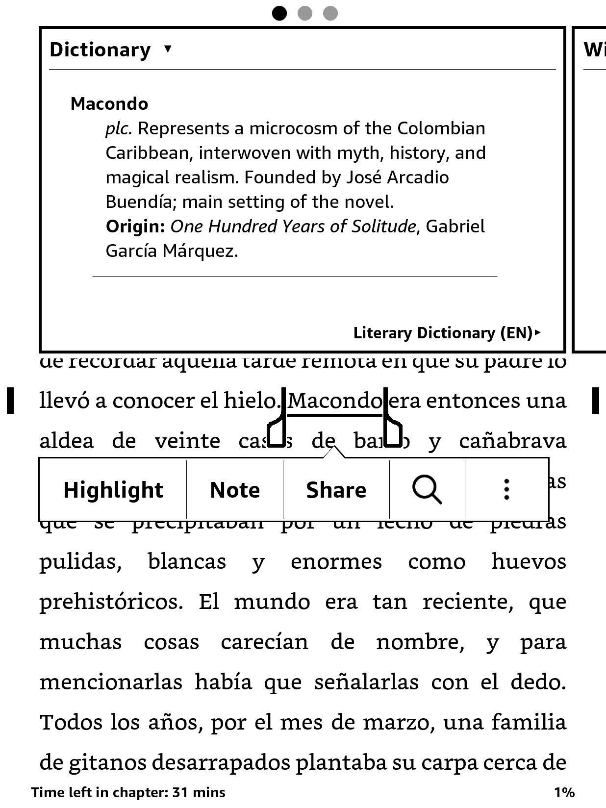
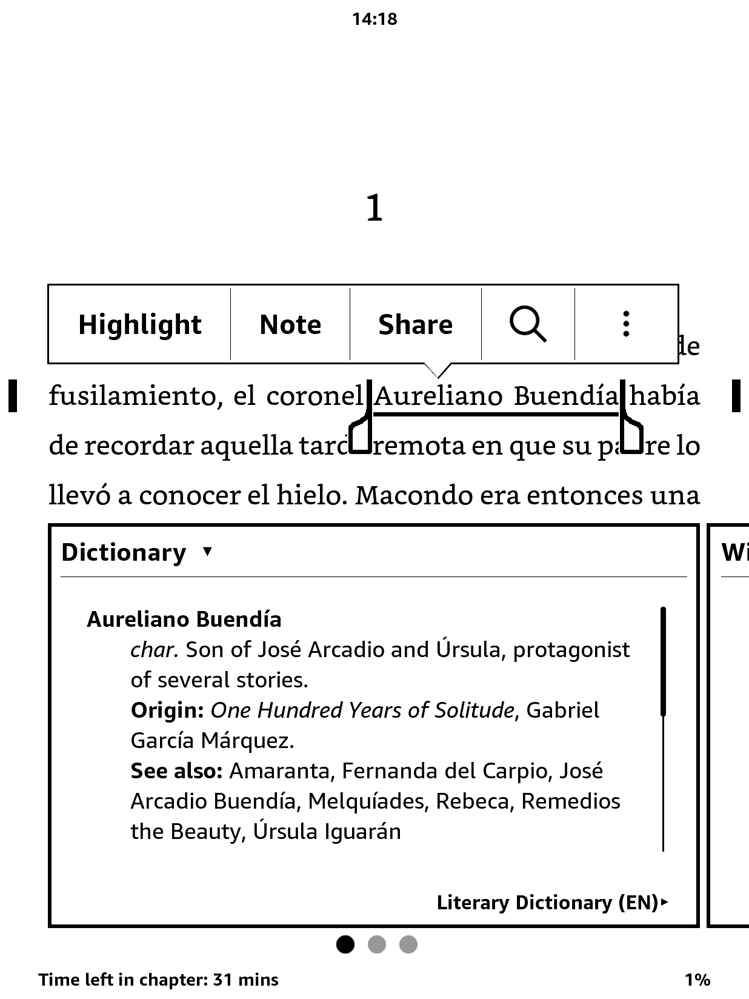
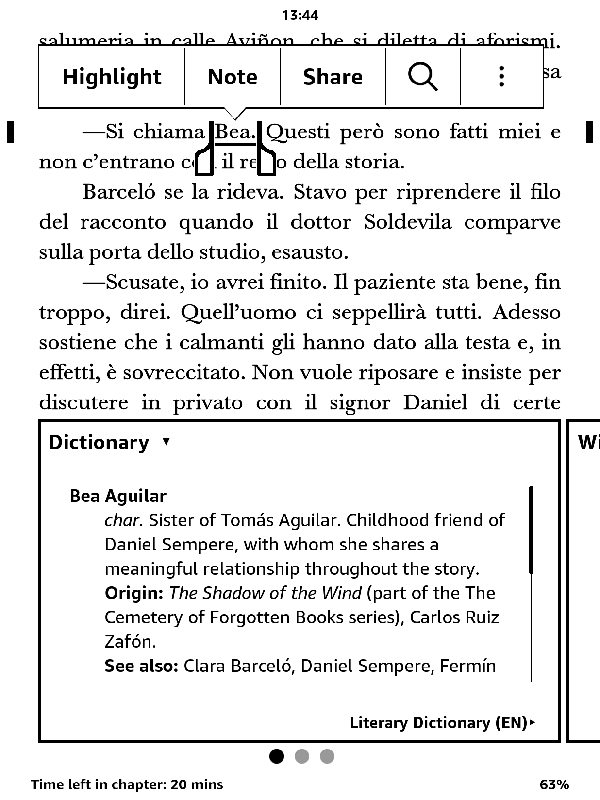
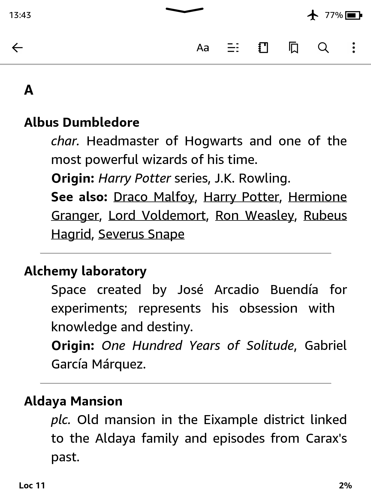
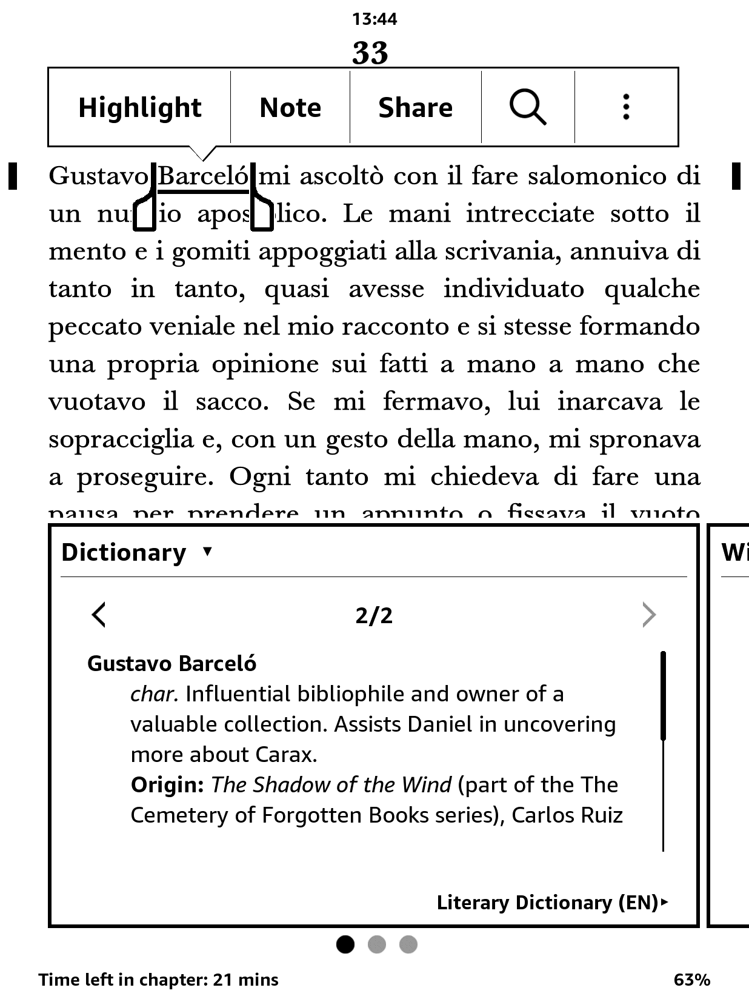
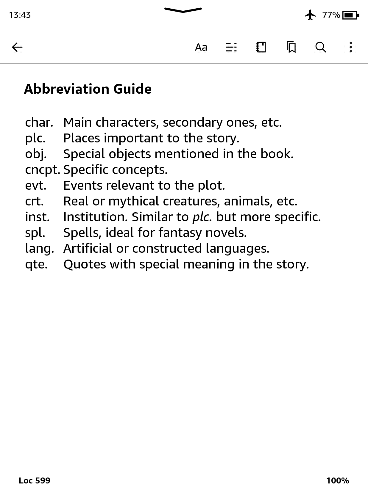
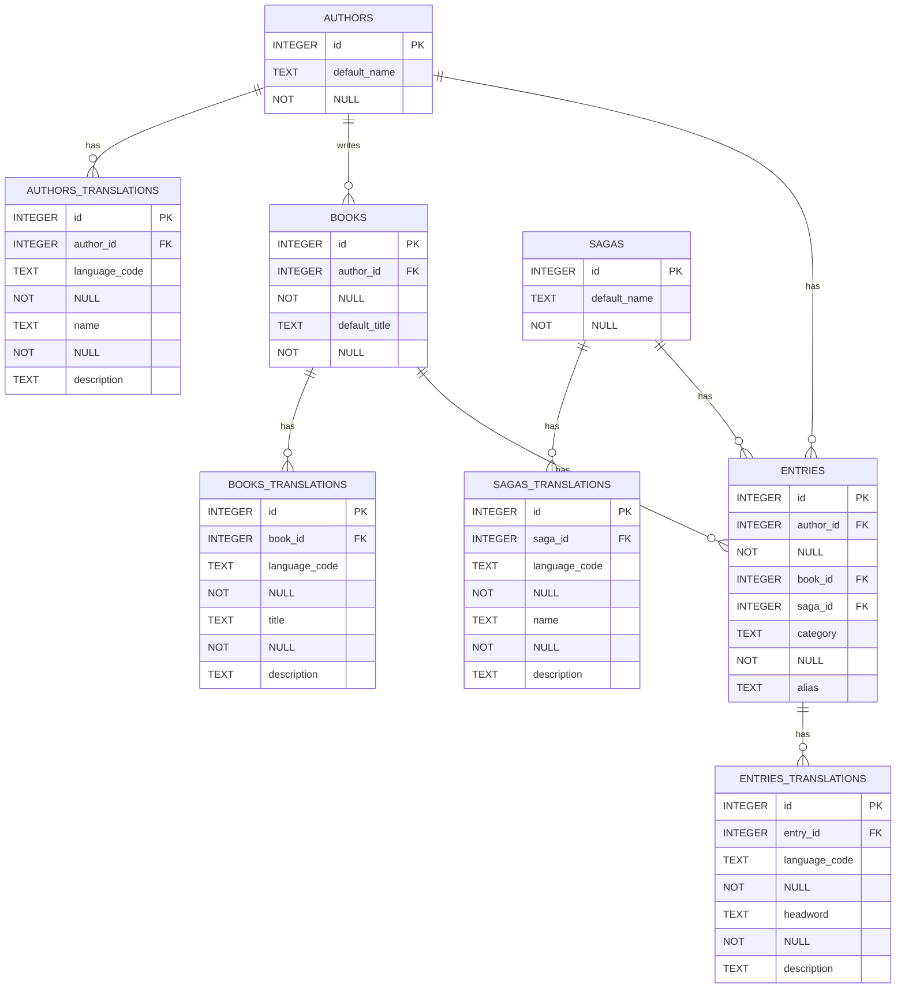

# 📚 Literary Dictionary for Kindle

**Your ultimate reading companion.**  
Lost in the maze of names from _One Hundred Years of Solitude_? Can’t remember if that magical object belonged to Frodo or Harry? This open-source **Literary Dictionary** helps you keep track of characters, places, and concepts from iconic books and sagas—right from your Kindle.

The dictionary is currently available in English and Spanish. Additional languages are planned for future releases. Each version is designed independently to ensure smooth reading and navigation on Kindle and other e-reader devices.

🎯 Download the latests version of the dictionary [here](https://github.com/cdmoro/literary-dictionary/releases/latest)

## ✨ Features

The **Literary Dictionary for Kindle** is designed to make your reading more immersive and less confusing—right from your device’s built-in dictionary tool.

### ✅ Key Features

- **Works with both single words and multi-word expressions**  
- **Supports books in any language**
- **Fully compatible with Kindle’s native dictionary system**
- **Cross-references characters, places, and concepts across literary universes**
- **Returns multiple definitions when a name matches more than one entry (e.g., family surnames)**
- **Clean and concise entries, optimized for fast lookup**
- **Lightweight, easy to install, and distraction-free**

### 📸 Screenshots

| Single Word Lookup | Multi-word Phrase | Foreign Language Support |
|--------------------|-------------------|---------------------------|
|  |  |  |

| Cross-referenced Entry | Multiple Definitions | Abbreviation Guide |
|------------------------|------------------------|------------------------|
|  |  |  |


---

## ✍️ How It Works

Entries are neatly organized in YAML files by author. Each file can cover a single book, an entire saga, or just the broader universe.

### ✅ Entry Structure

Each entry includes:
- `entry`: Main term
- `displayValue` (optional): Visual term
- `alias` (optional): Alternative names
- `description`: Definition

You can further categorize entries with:
- `characters`, `places`, `objects`, `concepts`, `events`, `creatures`, `institutions`, `spells`, `languages`, `quotes`

Everything you need, from Elvish languages to famous literary quotes.  
All stored in `dictionary/**/*.yaml`.

---

## 🛠️ How to Contribute

Love books and tech? Join the mission!

- Add new entries (in YAML format)
- Improve the Python scripts
- Report issues or suggest features
- Share your favorite literary universe!

You can also:
- ☕ [Buy me a coffee](https://buymeacoffee.com/cdmoro)
- 🧉 [Invite me a cafecito](http://cafecito.app/cdmoro)
- 🎁 [Support on Patreon](https://patreon.com/cdmoro)

---

## 🧪 Dev Setup

To build and test the dictionary locally:

```bash
git clone https://github.com/cdmoro/diccionario-literario.git
cd diccionario-literario
pip install -r requirements.txt
python scripts/build.py
```

It will generate several one dictionary per language in `output` folder.

Then:

1. Open Kindle Previewer
1. Load the generated EPUB or `dictionary_files_en/Dictionary.opf`
1. Export to MOBI
1. Copy to your Kindle’s dictionaries/ folder

You’re ready to go! 🔍📖

## Database


```mermaid
erDiagram
    AUTHORS {
        INTEGER id PK
        TEXT default_name NOT NULL
    }
    AUTHORS_TRANSLATIONS {
        INTEGER id PK
        INTEGER author_id FK
        TEXT language_code NOT NULL
        TEXT name NOT NULL
        TEXT description
    }

    BOOKS {
        INTEGER id PK
        INTEGER author_id FK NOT NULL
        TEXT default_title NOT NULL
    }
    BOOKS_TRANSLATIONS {
        INTEGER id PK
        INTEGER book_id FK
        TEXT language_code NOT NULL
        TEXT title NOT NULL
        TEXT description
    }

    SAGAS {
        INTEGER id PK
        TEXT default_name NOT NULL
    }
    SAGAS_TRANSLATIONS {
        INTEGER id PK
        INTEGER saga_id FK
        TEXT language_code NOT NULL
        TEXT name NOT NULL
        TEXT description
    }

    ENTRIES {
        INTEGER id PK
        INTEGER author_id FK NOT NULL
        INTEGER book_id FK
        INTEGER saga_id FK
        TEXT category NOT NULL
        TEXT alias
    }
    ENTRIES_TRANSLATIONS {
        INTEGER id PK
        INTEGER entry_id FK
        TEXT language_code NOT NULL
        TEXT headword NOT NULL
        TEXT description
    }

    AUTHORS ||--o{ AUTHORS_TRANSLATIONS : has
    BOOKS ||--o{ BOOKS_TRANSLATIONS : has
    SAGAS ||--o{ SAGAS_TRANSLATIONS : has
    AUTHORS ||--o{ BOOKS : writes
    AUTHORS ||--o{ ENTRIES : has
    BOOKS ||--o{ ENTRIES : has
    SAGAS ||--o{ ENTRIES : has
    ENTRIES ||--o{ ENTRIES_TRANSLATIONS : has

```

## 🙋‍♂️ About Me

Hi! I’m Carlos — book lover, coder, and Kindle hacker.

- 🐦 [Twitter](https://twitter.com/CarlosBonadeo)
- 💼 [LinkedIn](https://www.linkedin.com/in/cdbonadeo/)

Let’s bring literature to life, one lookup at a time.
