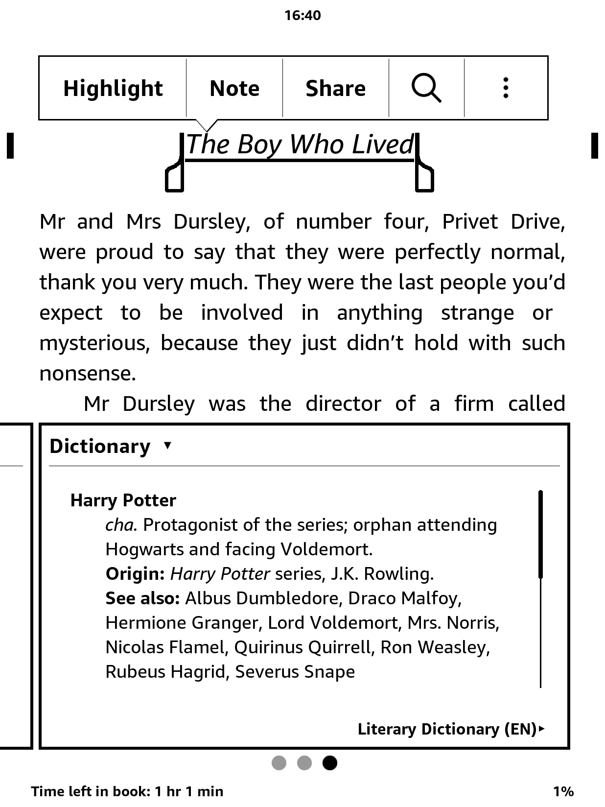

# 📚 Dicionário Literário para Kindle

[](README.md)
[](README.es.md)
[](README.it.md)
[](README.pt.md)

**Seu melhor companheiro de leitura.**  
Perdeu-se no labirinto de nomes de _Cem Anos de Solidão_? Não consegue lembrar se aquele objeto mágico pertencia a Frodo ou Harry? Este **Dicionário Literário** de código aberto ajuda você a acompanhar personagens, lugares e conceitos de livros e sagas icônicos — diretamente do seu Kindle.

O dicionário está disponível atualmente nos seguintes idiomas, cada um fornecido como um arquivo separado:

- 🇬🇧 Inglês — [Baixar](https://github.com/cdmoro/literary-dictionary/releases/download/v1.0.0/Bonadeo.Carlos.-.Diccionario.Literario.EN.v1.0.0.mobi)
- 🇪🇸 Espanhol — [Baixar](https://github.com/cdmoro/literary-dictionary/releases/download/v1.0.0/Bonadeo.Carlos.-.Diccionario.Literario.ES.v1.0.0.mobi)
- 🇮🇹 Italiano — Em breve!
- 🇧🇷 Português — Em breve!

🗒️ Você também pode visitar a seção [Lançamentos](https://github.com/cdmoro/literary-dictionary/releases) para ver o histórico de alterações e versões anteriores.

## ✨ Recursos

O **Dicionário Literário para Kindle** foi criado para tornar sua experiência de leitura mais imersiva e menos confusa — acessível diretamente do dicionário integrado ao seu dispositivo.

### ✅ Principais recursos

- **Suporta palavras únicas e expressões com várias palavras**
- **Funciona com livros em qualquer idioma**
- **Totalmente compatível com o sistema de dicionário nativo do Kindle**
- **Faz referências cruzadas entre personagens, lugares e conceitos em universos literários**
- **Retorna várias definições quando um nome tem mais de uma entrada (por exemplo, sobrenomes de família)**
- **Entradas limpas e concisas, otimizadas para pesquisa rápida**
- **Leve, fácil de instalar e sem distrações**

### 📸 Capturas de tela

| Pesquisa de palavra única | Frase com várias palavras | Suporte a múltiplas definições | Entradas de referência cruzada |
|:--------------------:|:-------------------:|:---------------------------:|:---------:|
|||||
| **Guia de abreviações** | **Índice de entradas por seção** | **Seção de autores** | **Seção de sagas** |
|||||

---

## 🛠️ Como contribuir

Adora livros e tecnologia? Junte-se à missão!

- Sugira novos livros para incluir
- Melhore os scripts Python
- Relate bugs ou solicite recursos
- Compartilhe seu universo literário favorito!

Você também pode:
- ☕ [Me pagar um café](https://buymeacoffee.com/cdmoro)
- 🧉 [Me convidar para um cafecito](http://cafecito.app/cdmoro)
- 🎁 [Apoiar no Patreon](https://patreon.com/cdmoro)

---

## 🧪 Configuração de desenvolvimento

Para compilar e testar o dicionário localmente:

```bash
git clone https://github.com/cdmoro/literary-dictionary.git
cd literary-dictionary
pip install -r requirements.txt
python ./main.py
```

Isso irá gerar vários dicionários por idioma na pasta `output`.

Em seguida:

1. Abra o Kindle Previewer 3
1. Carregue o EPUB gerado ou `dictionary_files_en/content.opf`
1. Exporte para MOBI
1. Copie para a pasta `documents/dictionaries` do seu Kindle

Você está pronto para começar! 🔍📖

## 🙋‍♂️ Sobre mim

Olá! Sou Carlos — amante de livros, programador e hacker do Kindle.

- 🐦 [Twitter](https://twitter.com/CarlosBonadeo)
- 💼 [LinkedIn](https://www.linkedin.com/in/cdbonadeo/)

Vamos dar vida à literatura, uma pesquisa de cada vez.

## Licença


Este conteúdo está licenciado sob uma licença [Creative Commons Attribution-NonCommercial 4.0 International (CC BY-NC 4.0)](https://creativecommons.org/licenses/by-nc/4.0/). Você tem permissão para copiar, redistribuir e modificar o conteúdo, desde que o crédito adequado seja dado e ele não seja usado para fins comerciais.